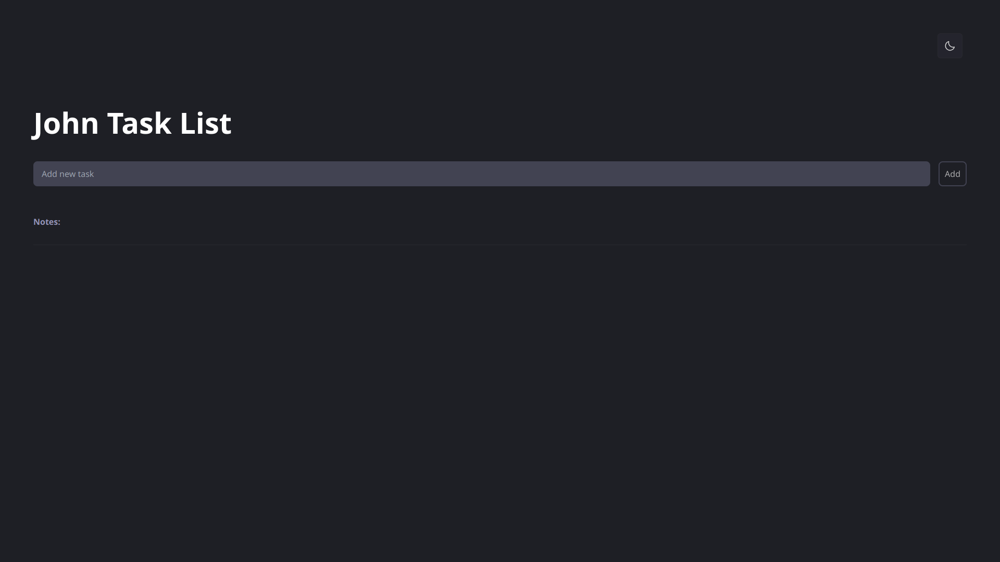

# John Task List

  
  

<h1>
  
</h1>

 

# # :computer: Techs

- [React](https://react.dev);
- [TailwindCSS](https://tailwindcss.com)
- [radixUI](https://www.radix-ui.com)
- [react-dnd](https://react-dnd.github.io/react-dnd/about)
- [phosphor-react](https://phosphoricons.com)

# # :book: Features

- Create Task
- Create Subtask
- Display Task List
- Mark Task as Completed
- Delete Task
- Order Tasks

# :memo: LICENSE

Esse projeto está sob a licença MIT. Veja o arquivo [LICENSE](LICENSE.md) para mais detalhes.
